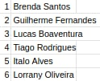
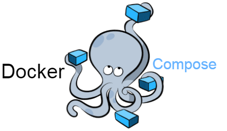
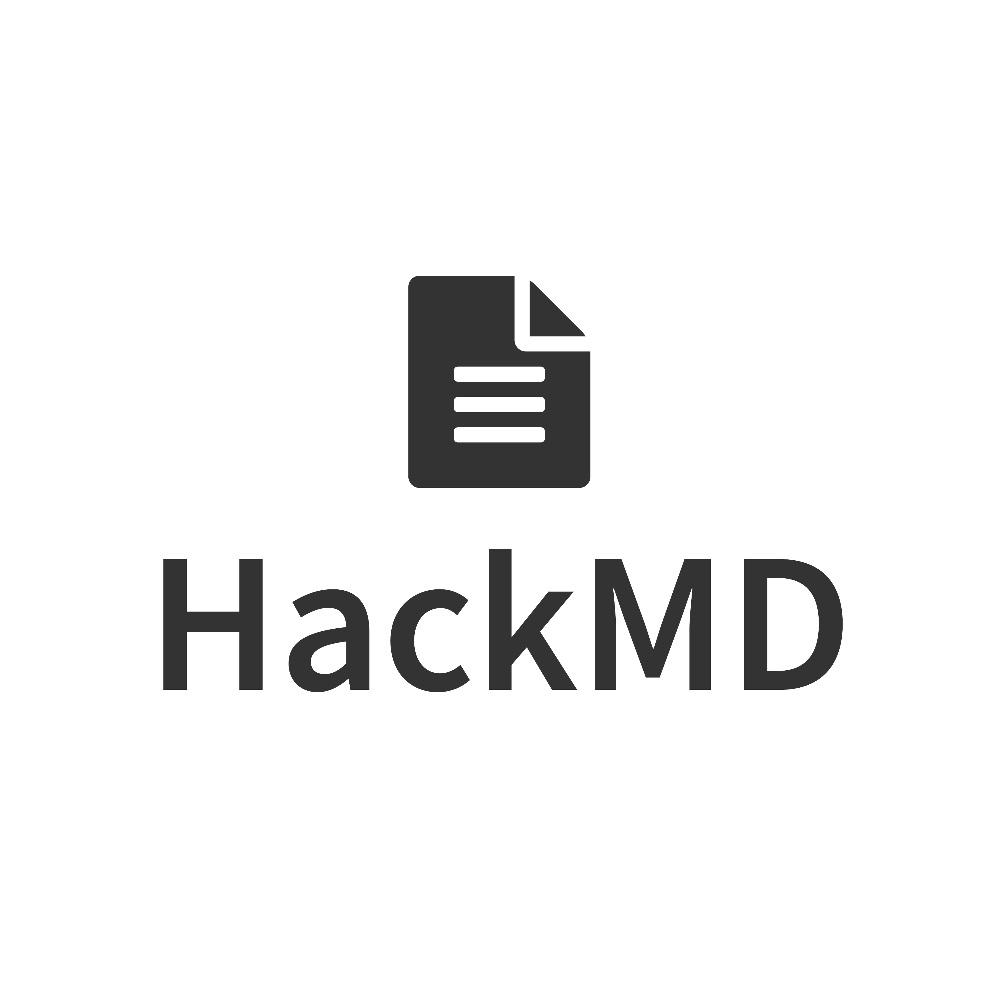
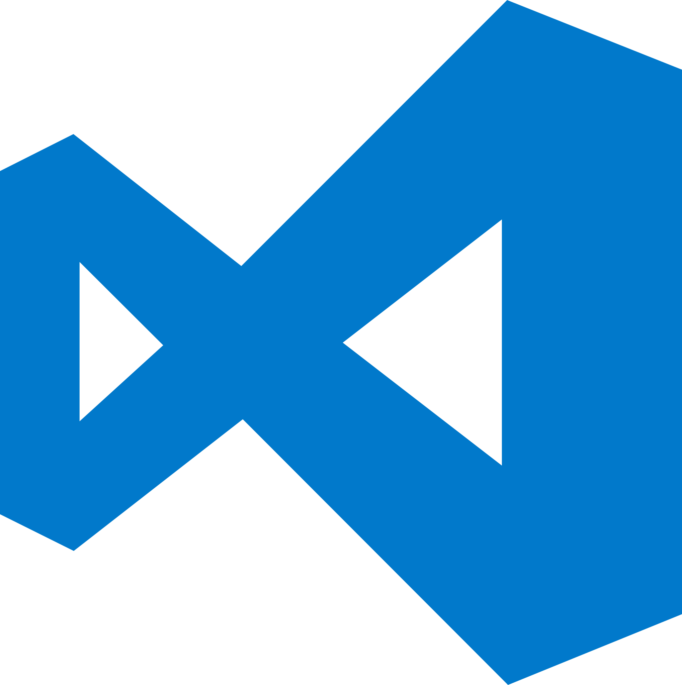

# Planejamento

## 1. Cronograma

 &emsp; O cronograma das tarefas do projeto foi baseado nas datas de entregas das atividades apresentadas no plano de ensino da disciplina de Requisitos de Software, visando atender às exigências de cada ponto de controle. É importante ressaltar que as datas podem ser alteradas futuramente, caso seja necessário.

### 1.1 Cronograma das etapas

| Etapas | Título                         | Data        | Descrição                                                                  |
| ------ | ------------------------------------- | ----------- | -------------------------------------------------------------------------- |
| I      | Apresentação 1 | 05/03 | Planejamento do Projeto, Equipe, Listas de sites avaliados, Site selecionado, Ferramentas utilizadas no projeto, Processo de Design, Cronograma das atividades. |
| II     | Apresentação 2 | 19/03 |  Perfil do usuário, Personas e Análise de Tarefas |
| III    | Apresentação 3 | 26/03 |  Princípios Gerais de Projeto, Metas de usabilidade, Guia de Estilo. |
| IV     | Apresentação 4 | 09/04 | Planejamento da Avaliação e planejamento do relato dos resultados da avaliação do Storyboard e Análise de tarefas |
| V      | Apresentação 5 | 23/04 | Relato dos resultados do Story Board, Análise de tarefas e o Planejamento da Avaliação e do relato dos resultados da avaliação do Protótipo de Papel. |
| VI     | Apresentação 6 | 30/04 | Relato dos resultados do Protótipo de Papel e Planejamento da Avaliação e do relato dos resultados da avaliação do protótipo de alta fidelidade. |
| VII    | Apresentação Final | 10/05 |   |

 

## 2. Metodologia

### 2.1 Scrum:

 &emsp; O Scrum é uma metodologia ágil que contém diversas rotinas para manter a equipe engajada e atualizada sobre o projeto, de forma a se organizarem enquanto resolvem um problema e a refletirem sobre os êxitos e falhas para melhorarem continuamente. Scrum é um framework estrutural usado para gerenciar o desenvolvimento de produtos. Ele é fundado nos princípios de transparência, inspeção e adaptação. Aos princípios do Scrum integramos eventos, papéis e artefatos, administrando as relações e interações entre eles.

### 2.2 Kanban:

 &emsp; O Kanban é uma simbologia visual usada no desenvolvimento de produtos para registrar o progresso das atividades. Essa metodologia foi criada pela empresa Toyota e integra o famoso sistema Toyota de produção.

 &emsp; Ele é orientado através de colunas, em que cada uma representa diferentes estados de progresso de uma atividade (a fazer, fazendo, feito), de forma que as atividades (cartões visuais) vão transitando entre as colunas, mostrando o andamento do projeto.

### 2.3 Política de Branches

 &emsp; O Git Flow do repositório de documentação será tratado da forma mostrada na imagem acima. Para uma mudança chegar a branch master (branch estável), os passos abaixo são seguidos:

1. Toda nova branch deve ser feita a partir da master
2. Ao resolver a issue proposta, a nova branch deve ser merjada e comparada em relação a master
3. Caso o PR seja aprovado pela equipe a nova branch será deletada e seu conteúdo integrado a master

#### 2.3.1 Regras de Nomenclatura

 &emsp; Toda nova branch criada no repositório do projeto deve se propor a resolver uma issue específica, sendo que o nome da branch deve seguir as seguintes regras:

1. Conter o código da issue fornecido pelo GitHub
2. Ser curto e expressivo a respeito da issue a ser tratada
3. As palavras devem ser separadas por um hífen "-"
4. Ser escrito em "lower case"

Exemplo:

    1-rich-picture

### 2.4 Política de commits:

 &emsp; Os commits devem ser pequenos e para resolver um problema específico e a mensagem do commit deve relatar o que foi feito de maneira sucinta e direta. Além disso, ela precisa estar em português, começar com um verbo e com a primeira letra maiúscula.

 &emsp;  Contribuições feitas por mais de uma pessoa devem conter o comando "Co-authored-by" para identificar todos os autores envolvidos.

Exemplo de contribuição feita por um autor:

    git commit -m "Adiciona documento de planejamento"

Exemplo de contribuição feita por mais de um autor:

    git commit -m "Cria Rich Picture

    Co-authored-by: Pessoa <emailgit@email.com>"

### 2.5 Política de pull requests:

 &emsp; Para realizar um Pull Request (PR) para o repositório, é necessário seguir os passos abaixo.

1. Ao resolver uma issue, suba suas contribuições e crie um Pull Request
2. Escreva um título sucinto para o PR
3. Preencha a descrição do PR seguindo os passos e as orientações do template que será mostrado
4. Ligue o PR com a issue que ele resolve
5. Preencha informações adicionais caso possua (executores, revisores, etc)
6. Um PR só poderá ser merjado após duas aprovações.

## 3. Horários disponíveis dos integrantes

 &emsp; A tabela a seguir mostra os horários diários dos integrantes da equipe, visando o melhor aproveitamento do tempo para possíveis reuniões futuras.

* Relação de Membros     

1. Brenda Santos
2. Guilherme Fernandes
3. Lucas Boaventura
4. Tiago Rodrigues
5. Italo Alves
6. Lorrany Oliveira        
      

 
 

## 4. Ferramentas

|                                                                     | Ferramenta      | Finalidade                                                    |
| ------------------------------------------------------------------- | --------------- | ------------------------------------------------------------- |
|              | GitHub          | Hospedagem e versionamento de código                          |
|        | GitHub Pages    | Hospedagem de página web para repositório GitHub              |
|              | Docker          | Ferramenta de isolamento de ambiente                          |
|      | Docker-Compose  | Ferramenta de gerenciamento de containers                     |
|              | Zenhub          | Ferramenta para gerenciamento do kanban no github             |
|              | HackMD          | Ferramenta para edição colaborativa de documentos em markdown |
|         | Google Meet     | Ferramenta para reunião online                                |
|               | Google Drive    | Ferramenta para compartilhamento de documentos e imagens      |
|  | VS Code         | Ferramenta para edição e adição de documentos                 |
|     | Microsoft Teams | Ferramenta para gravação das apresentações da equipe          |
|           | Telegram        | Ferramenta para comunicação da equipe                         |
|           | Figma        | Ferramenta para desenvolvimento de protótipos de interface                         |
|           | Discord        | Ferramenta para comunicação da equipe   |

## 5.1 Sites avaliados
- [Banco Central do Brasil](https://www.bcb.gov.br/)
- [Defensoria Pública do Estado de São Paulo](https://www.defensoria.sp.def.br/dpesp/)

## 5.2 Site selecionado

- [Defensoria Pública do Estado de São Paulo](https://www.defensoria.sp.def/br/dpesp/)
 

## 6. Processo de Design

## 7. Versionamento

| Data       | Versão | Descrição                                    | Autor                                                         |
| ---------- | ------ | -------------------------------------------- | ------------------------------------------------------------- |
| 02/03/2021 | 1.0    | Desenvolvimento do documento de planejamento | Tiago Samuel, Guilherme Fernandes, Ítalo Alves, Brenda Santos, Lorrany Oliveira |
| 06/05/2021 | 2.0    | Revisão do Documento de Planejamento | Guilherme Fernandes |