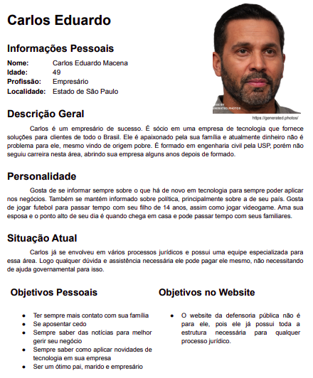

# Personas

## Introdução

 &emsp; 
    Segundo, Cooper et al., 2014; Pruitt e Adlin, 2006; Cooper, 1999, as personas são como um tipo de personagem fictício. São consideradas assim porque são criadas com o intuito de representar um usuário, seja ele um que utiliza o sistema ou não. Como desempenha um papel fundamental, deve ser criada de modo que seja o mais fiel possível à uma pessoa, devendo levar em conta que devem ser criadas no mínimo 3 e no máximo 12, mínimo 3 porque se for menos pode acabar faltando informação e máximo 12 para não confundir a cabeça da equipe de design.

## Metodologia

 &emsp; Para criação das personas foi levado em conta os critérios descritos por Courage e Baxter(2005):

- Identidade: definir nome, sobrenome, idade, dados demográficos e foto;
- Status: definir se é primária, secundária, stakeholder ou antiusuário;
- Objetivos: definir os objetivos dessa persona;
- Habilidades: definir as habilidades dessa persona;
- Tarefas: definir tarefas que essa persona realiza;
- Relacionamentos: definir o relacionamento dessa persona com as outras;
- Requisitos: definir de que essa persona precisa;
- Expectativas: definir o que essa persona está esperando do sistema;

## Personas

- Antipersona

- Persona primária

- Persona primária

- Persona primária

## Versionamento

|    Data    | Versão |                  Descrição                  |               Autores               |
| :--------: | :----: | :-----------------------------------------: | :---------------------------------: |
| 19/03/2021 |  0.1   | Criação da estrutura principal do documento | Lorrany Oliveira e Tiago Samuel |
